# 🏗️ Solo Accountant AI - Complete Architecture Diagram

## System Architecture Overview

```mermaid
graph TB
    %% External Users
    A[👨‍💼 Accountants] --> B[🌐 Vercel Frontend]
    C[🏢 Small Business Clients] --> B
    
    %% Frontend Layer
    B --> D[📱 Next.js 14 App Router]
    D --> E[🎨 React 18 + TypeScript]
    E --> F[💅 Tailwind CSS + UI Components]
    
    %% Authentication & Authorization
    D --> G[🔐 Supabase Auth]
    G --> H[🛡️ Row Level Security RLS]
    H --> I[👥 Role-Based Access Control]
    
    %% API Layer
    D --> J[🔌 Next.js API Routes]
    J --> K[🤖 AI Processing APIs]
    J --> L[📄 Receipt Processing APIs]
    J --> M[📊 Report Generation APIs]
    J --> N[💳 QuickBooks Integration APIs]
    
    %% AI & External Services
    K --> O[🧠 OpenAI GPT-4]
    L --> P[👁️ Mindee OCR API]
    N --> Q[📚 QuickBooks API]
    M --> R[📋 PDF Generation Service]
    
    %% Database Layer
    J --> S[🗄️ Supabase PostgreSQL]
    S --> T[📊 Transactions Table]
    S --> U[🧾 Receipts Table]
    S --> V[📈 Reports Table]
    S --> W[👤 Users & Profiles]
    S --> X[📝 Activity Logs]
    
    %% File Storage
    L --> Y[☁️ Supabase Storage]
    Y --> Z[🗂️ Encrypted File Storage]
    
    %% Monitoring & Logging
    J --> AA[📊 Performance Monitoring]
    J --> BB[🔍 Structured Logging]
    J --> CC[⚠️ Error Tracking]
    
    %% Security Layer
    subgraph Security ["🛡️ Security Layer"]
        DD[🔒 TLS 1.3 Encryption]
        EE[🛡️ Input Validation]
        FF[🚫 Rate Limiting]
        GG[🔐 JWT Token Management]
    end
    
    %% Styling
    classDef userClass fill:#e1f5fe,stroke:#01579b,stroke-width:2px
    classDef frontendClass fill:#f3e5f5,stroke:#4a148c,stroke-width:2px
    classDef apiClass fill:#e8f5e8,stroke:#1b5e20,stroke-width:2px
    classDef aiClass fill:#fff3e0,stroke:#e65100,stroke-width:2px
    classDef dbClass fill:#fce4ec,stroke:#880e4f,stroke-width:2px
    classDef securityClass fill:#ffebee,stroke:#b71c1c,stroke-width:2px
    
    class A,C userClass
    class B,D,E,F frontendClass
    class J,K,L,M,N apiClass
    class O,P,Q,R aiClass
    class S,T,U,V,W,X,Y,Z dbClass
    class DD,EE,FF,GG securityClass
```



## Data Flow Architecture

```mermaid
sequenceDiagram
    participant A as 👨‍💼 Accountant
    participant C as 🏢 Client
    participant F as 🌐 Frontend
    participant API as 🔌 API Layer
    participant AI as 🤖 AI Services
    participant DB as 🗄️ Database
    participant QB as 📚 QuickBooks
    participant OCR as 👁️ OCR Service
    
    %% Authentication Flow
    A->>F: Login Request
    F->>API: Authenticate
    API->>DB: Verify Credentials
    DB-->>API: User Profile
    API-->>F: JWT Token
    F-->>A: Dashboard Access
    
    %% QuickBooks Integration
    A->>F: Connect QuickBooks
    F->>API: OAuth Request
    API->>QB: OAuth Flow
    QB-->>API: Access Token
    API->>DB: Store Encrypted Token
    API->>QB: Fetch Transactions
    QB-->>API: Transaction Data
    API->>DB: Store Transactions
    
    %% AI Categorization
    A->>F: Request AI Categorization
    F->>API: Process Transactions
    API->>AI: Send Transaction Data
    AI-->>API: Category Suggestions
    API->>DB: Update Categories
    API-->>F: Results
    F-->>A: Review Interface
    
    %% Receipt Processing
    C->>F: Upload Receipt
    F->>API: Process Receipt
    API->>OCR: Extract Data
    OCR-->>API: Receipt Data
    API->>AI: Match to Transaction
    AI-->>API: Match Results
    API->>DB: Store Receipt & Match
    API-->>F: Processing Complete
    F-->>C: Receipt Processed
    
    %% Report Generation
    A->>F: Generate Report
    F->>API: Create Report
    API->>DB: Fetch Financial Data
    DB-->>API: Transaction Data
    API->>AI: Generate Insights
    AI-->>API: Business Report
    API->>DB: Store Report
    API-->>F: Report Ready
    F-->>A: View/Share Report
```



## Component Architecture

```mermaid
graph LR
    %% Frontend Components
    subgraph Frontend ["🎨 Frontend Components"]
        A[🏠 Dashboard]
        B[🤖 AI Cleanup]
        C[🧾 Receipt Upload]
        D[📊 Report Viewer]
        E[👤 Client Portal]
        F[🔐 Authentication]
    end
    
    %% API Endpoints
    subgraph API ["🔌 API Endpoints"]
        G[/api/ai/categorize]
        H[/api/receipts/upload]
        I[/api/reports/generate]
        J[/api/quickbooks/auth]
        K[/api/receipts/match]
        L[/api/reports/export]
    end
    
    %% Services Layer
    subgraph Services ["⚙️ Services Layer"]
        M[🧠 AI Service]
        N[👁️ OCR Service]
        O[📊 Report Service]
        P[💳 QuickBooks Service]
        Q[📁 File Service]
        R[🔐 Auth Service]
    end
    
    %% Data Layer
    subgraph Data ["🗄️ Data Layer"]
        S[(👤 Users)]
        T[(📊 Transactions)]
        U[(🧾 Receipts)]
        V[(📈 Reports)]
        W[(📝 Logs)]
        X[☁️ File Storage]
    end
    
    %% Connections
    A --> G
    B --> G
    C --> H
    D --> I
    E --> K
    F --> J
    
    G --> M
    H --> N
    I --> O
    J --> P
    K --> N
    L --> Q
    
    M --> S
    N --> U
    O --> V
    P --> T
    Q --> X
    R --> S
    
    %% Styling
    classDef frontendClass fill:#e3f2fd,stroke:#1565c0,stroke-width:2px
    classDef apiClass fill:#e8f5e8,stroke:#2e7d32,stroke-width:2px
    classDef serviceClass fill:#fff3e0,stroke:#f57c00,stroke-width:2px
    classDef dataClass fill:#fce4ec,stroke:#c2185b,stroke-width:2px
    
    class A,B,C,D,E,F frontendClass
    class G,H,I,J,K,L apiClass
    class M,N,O,P,Q,R serviceClass
    class S,T,U,V,W,X dataClass
```

## Security Architecture

```mermaid
graph TB
    %% External Threats
    A[🌐 Internet] --> B[🛡️ Vercel Edge Network]
    
    %% Security Layers
    B --> C[🔒 TLS 1.3 Encryption]
    C --> D[🚫 Rate Limiting]
    D --> E[🛡️ Input Validation]
    E --> F[🔐 Authentication Layer]
    
    %% Authentication & Authorization
    F --> G[📱 Frontend Application]
    F --> H[🔌 API Gateway]
    
    %% API Security
    H --> I[🎫 JWT Token Validation]
    I --> J[👥 Role-Based Access Control]
    J --> K[🛡️ Row Level Security RLS]
    
    %% Data Protection
    K --> L[🗄️ Encrypted Database]
    K --> M[☁️ Encrypted File Storage]
    
    %% External Service Security
    H --> N[🤖 AI Service Security]
    H --> O[👁️ OCR Service Security]
    H --> P[💳 QuickBooks OAuth]
    
    %% Security Monitoring
    subgraph Monitoring ["📊 Security Monitoring"]
        Q[🔍 Audit Logging]
        R[⚠️ Threat Detection]
        S[📈 Security Metrics]
        T[🚨 Incident Response]
    end
    
    H --> Monitoring
    
    %% Security Controls
    subgraph Controls ["🛡️ Security Controls"]
        U[🔐 Multi-Factor Auth Ready]
        V[🔄 Token Rotation]
        W[🚫 CORS Protection]
        X[🛡️ XSS Prevention]
        Y[🔒 CSRF Protection]
    end
    
    F --> Controls
    
    %% Styling
    classDef securityClass fill:#ffebee,stroke:#d32f2f,stroke-width:3px
    classDef authClass fill:#e8eaf6,stroke:#3f51b5,stroke-width:2px
    classDef dataClass fill:#e0f2f1,stroke:#00695c,stroke-width:2px
    classDef monitorClass fill:#fff3e0,stroke:#ef6c00,stroke-width:2px
    
    class B,C,D,E,I,J,K securityClass
    class F,G,H,U,V,W,X,Y authClass
    class L,M dataClass
    class Q,R,S,T monitorClass
```



## AI Processing Pipeline

```mermaid
flowchart TD
    %% Input Sources
    A[📊 QuickBooks Transactions] --> B[🔄 Data Ingestion]
    C[🧾 Receipt Images] --> D[👁️ OCR Processing]
    
    %% AI Processing
    B --> E[🤖 AI Categorization Engine]
    D --> F[🔍 Receipt Data Extraction]
    F --> G[🎯 Transaction Matching]
    
    %% AI Models
    E --> H[🧠 GPT-4 Classification]
    G --> I[🧠 GPT-4 Matching Logic]
    
    %% Confidence Scoring
    H --> J[📊 Confidence Scoring]
    I --> K[📊 Match Confidence]
    
    %% Decision Logic
    J --> L{High Confidence?}
    K --> M{Strong Match?}
    
    %% Outcomes
    L -->|Yes| N[✅ Auto-Approve]
    L -->|No| O[👤 Manual Review]
    M -->|Yes| P[🔗 Auto-Link]
    M -->|No| Q[👤 Manual Match]
    
    %% Report Generation
    N --> R[📈 Report Generation]
    P --> R
    O --> R
    Q --> R
    
    R --> S[🧠 GPT-4 Business Insights]
    S --> T[📋 Plain English Reports]
    T --> U[📄 PDF Export]
    
    %% Styling
    classDef inputClass fill:#e3f2fd,stroke:#1976d2,stroke-width:2px
    classDef aiClass fill:#fff3e0,stroke:#f57c00,stroke-width:2px
    classDef decisionClass fill:#e8f5e8,stroke:#388e3c,stroke-width:2px
    classDef outputClass fill:#fce4ec,stroke:#c2185b,stroke-width:2px
    
    class A,C inputClass
    class E,F,G,H,I,S aiClass
    class J,K,L,M decisionClass
    class N,O,P,Q,R,T,U outputClass
```



## Database Schema Architecture


## Deployment Architecture

```mermaid
graph TB
    %% Development
    A[👨‍💻 Developer] --> B[📝 Git Repository]
    B --> C[🔄 GitHub Actions CI/CD]
    
    %% Build & Deploy
    C --> D[🏗️ Vercel Build]
    D --> E[🚀 Vercel Deployment]
    
    %% Production Environment
    E --> F[🌐 Vercel Edge Network]
    F --> G[⚡ Serverless Functions]
    F --> H[📱 Static Assets CDN]
    
    %% Database & Storage
    G --> I[🗄️ Supabase PostgreSQL]
    G --> J[☁️ Supabase Storage]
    G --> K[🔐 Supabase Auth]
    
    %% External Services
    G --> L[🧠 OpenAI API]
    G --> M[👁️ Mindee OCR API]
    G --> N[💳 QuickBooks API]
    
    %% Monitoring & Observability
    G --> O[📊 Vercel Analytics]
    G --> P[🔍 Structured Logging]
    G --> Q[⚠️ Error Tracking]
    
    %% Security & Performance
    F --> R[🛡️ DDoS Protection]
    F --> S[🔒 SSL/TLS Termination]
    F --> T[🚀 Global CDN]
    
    %% Backup & Recovery
    I --> U[💾 Automated Backups]
    J --> V[🔄 File Replication]
    
    %% Styling
    classDef devClass fill:#e3f2fd,stroke:#1565c0,stroke-width:2px
    classDef deployClass fill:#e8f5e8,stroke:#2e7d32,stroke-width:2px
    classDef prodClass fill:#fff3e0,stroke:#f57c00,stroke-width:2px
    classDef dataClass fill:#fce4ec,stroke:#c2185b,stroke-width:2px
    classDef extClass fill:#f3e5f5,stroke:#7b1fa2,stroke-width:2px
    classDef secClass fill:#ffebee,stroke:#d32f2f,stroke-width:2px
    
    class A,B,C devClass
    class D,E deployClass
    class F,G,H prodClass
    class I,J,K,U,V dataClass
    class L,M,N extClass
    class O,P,Q,R,S,T secClass
```



## Technology Stack Overview

```mermaid
mindmap
  root((🏗️ Solo Accountant AI))
    🎨 Frontend
      Next.js 14
        App Router
        Server Components
        Client Components
      React 18
        TypeScript 5.5
        Hooks & Context
      Tailwind CSS 3.4
        Component Library
        Responsive Design
        Dark Mode Ready
    🔌 Backend
      Next.js API Routes
        Serverless Functions
        Edge Runtime
      Node.js Runtime
        TypeScript
        ES Modules
      Authentication
        Supabase Auth
        JWT Tokens
        RLS Policies
    🗄️ Database
      Supabase PostgreSQL
        Row Level Security
        Real-time Subscriptions
        Automated Backups
      File Storage
        Encrypted Storage
        CDN Distribution
        Signed URLs
    🤖 AI & External
      OpenAI GPT-4
        Transaction Categorization
        Report Generation
        Business Insights
      Mindee OCR
        Receipt Processing
        Data Extraction
        Confidence Scoring
      QuickBooks API
        OAuth Integration
        Transaction Sync
        Real-time Updates
    🚀 Deployment
      Vercel Platform
        Global CDN
        Edge Functions
        Analytics
      CI/CD Pipeline
        GitHub Actions
        Automated Testing
        Zero Downtime
    🛡️ Security
      TLS 1.3 Encryption
      Input Validation
      Rate Limiting
      OWASP Compliance
        SQL Injection Prevention
        XSS Protection
        CSRF Protection
```



## Performance & Scalability

```mermaid
graph LR
    %% Load Balancing
    A[👥 Users] --> B[🌐 Global CDN]
    B --> C[⚡ Edge Locations]
    C --> D[🔄 Load Balancer]
    
    %% Application Tier
    D --> E[📱 Frontend Instances]
    D --> F[🔌 API Instances]
    
    %% Caching Layer
    E --> G[💾 Browser Cache]
    F --> H[⚡ Redis Cache]
    F --> I[🗄️ Database Cache]
    
    %% Database Tier
    H --> J[🗄️ Primary Database]
    I --> J
    J --> K[📖 Read Replicas]
    
    %% File Storage
    F --> L[☁️ Object Storage]
    L --> M[🌐 CDN Distribution]
    
    %% External Services
    F --> N[🤖 AI Services]
    F --> O[👁️ OCR Services]
    F --> P[💳 QuickBooks API]
    
    %% Monitoring
    subgraph Monitoring ["📊 Performance Monitoring"]
        Q[📈 Metrics Collection]
        R[🔍 Log Aggregation]
        S[⚠️ Alert Management]
        T[📊 Dashboard Analytics]
    end
    
    F --> Monitoring
    
    %% Auto Scaling
    subgraph Scaling ["🔄 Auto Scaling"]
        U[📊 Load Metrics]
        V[⚡ Scale Up/Down]
        W[🎯 Target Utilization]
    end
    
    D --> Scaling
    
    %% Styling
    classDef userClass fill:#e3f2fd,stroke:#1565c0,stroke-width:2px
    classDef appClass fill:#e8f5e8,stroke:#2e7d32,stroke-width:2px
    classDef cacheClass fill:#fff3e0,stroke:#f57c00,stroke-width:2px
    classDef dataClass fill:#fce4ec,stroke:#c2185b,stroke-width:2px
    classDef extClass fill:#f3e5f5,stroke:#7b1fa2,stroke-width:2px
    classDef monClass fill:#ffebee,stroke:#d32f2f,stroke-width:2px
    
    class A,B,C userClass
    class D,E,F appClass
    class G,H,I cacheClass
    class J,K,L,M dataClass
    class N,O,P extClass
    class Q,R,S,T,U,V,W monClass
```



---

## 📊 Architecture Summary

### **🏗️ COMPREHENSIVE SYSTEM DESIGN**

**Solo Accountant AI** is built on a modern, scalable architecture that leverages:

- **Frontend:** Next.js 14 with React 18 and TypeScript for type-safe, performant UI
- **Backend:** Serverless API architecture with comprehensive error handling
- **Database:** Supabase PostgreSQL with Row Level Security for multi-tenant isolation
- **AI Integration:** OpenAI GPT-4 for intelligent categorization and report generation
- **OCR Processing:** Mindee API for accurate receipt data extraction
- **Security:** Multi-layer security with encryption, authentication, and monitoring
- **Deployment:** Vercel platform with global CDN and edge computing
- **Monitoring:** Comprehensive observability with structured logging and metrics

### **🎯 KEY ARCHITECTURAL PRINCIPLES**

1. **Security by Design** - Multi-layer security architecture
2. **Scalability First** - Serverless and auto-scaling infrastructure
3. **Performance Optimized** - CDN, caching, and efficient data flow
4. **AI-Powered** - Intelligent automation throughout the platform
5. **User-Centric** - Professional interfaces for both accountants and clients
6. **Compliance Ready** - Built for regulatory requirements (SOX, GDPR, PCI)

### **🚀 PRODUCTION READINESS**

The architecture is designed for immediate production deployment with:
- **99.9% Uptime** - Redundant systems and failover mechanisms
- **Global Scale** - CDN and edge computing for worldwide performance
- **Enterprise Security** - Comprehensive protection and compliance
- **AI Automation** - Intelligent processing that scales with usage
- **Professional UX** - Intuitive interfaces that drive user adoption

**This architecture positions Solo Accountant AI as a market-leading platform capable of serving thousands of accountants and their clients with exceptional performance, security, and user experience.**